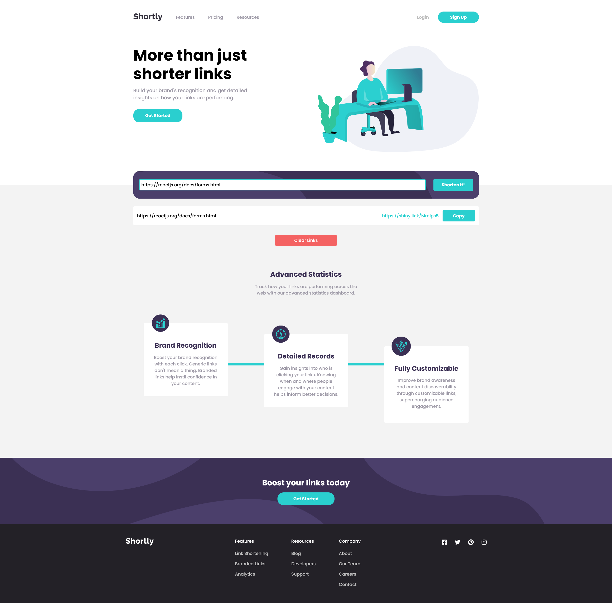
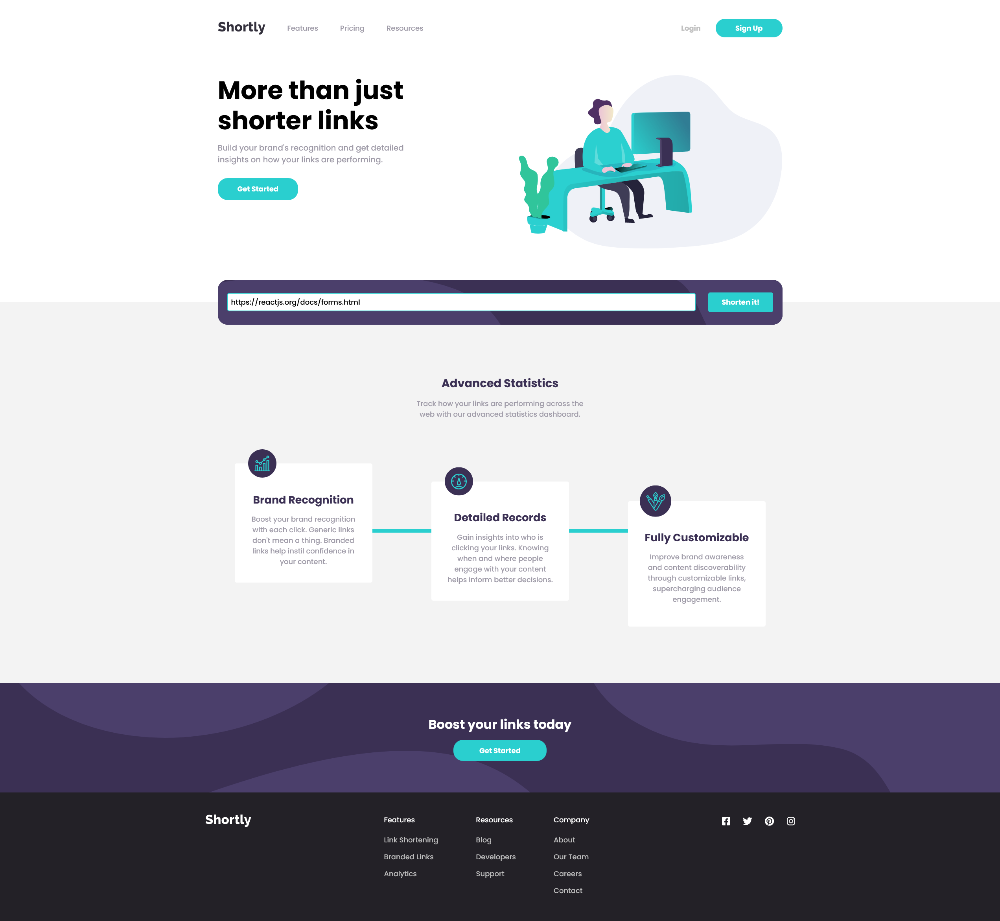
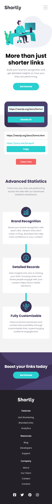
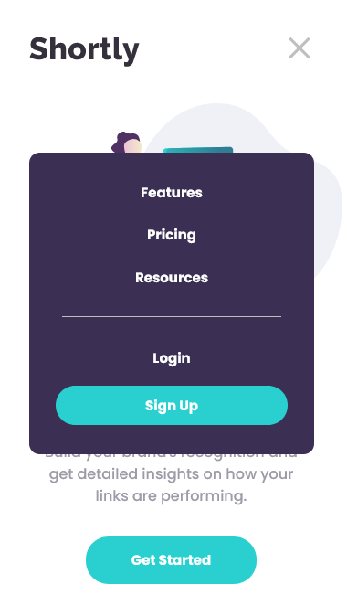

# Frontend Mentor - Shortly URL shortening API Challenge solution

This is a solution to the [Shortly URL shortening API Challenge challenge on Frontend Mentor](https://www.frontendmentor.io/challenges/url-shortening-api-landing-page-2ce3ob-G). Frontend Mentor challenges help you improve your coding skills by building realistic projects.

## Table of contents

- [Overview](#overview)
  - [The challenge](#the-challenge)
  - [Screenshot](#screenshot)
  - [Links](#links)
- [My process](#my-process)
  - [Built with](#built-with)
  - [What I learned](#what-i-learned)
  - [Continued development](#continued-development)
  - [Useful resources](#useful-resources)
- [Author](#author)

## Overview

### The challenge

Users should be able to:

- View the optimal layout for the site depending on their device's screen size
- Shorten any valid URL
- See a list of their shortened links, even after refreshing the browser
- Copy the shortened link to their clipboard in a single click
- Receive an error message when the `form` is submitted if:
  - The `input` field is empty

### Screenshot

### Links

- Solution URL: [Repo](https://github.com/CallMe-AL/fementor-url-shortening)
- Live Site URL: [Live Site](https://callme-al.github.io/fementor-url-shortening/)

## My process

### Built with

- Semantic HTML5 markup
- CSS custom properties
- Flexbox
- CSS Grid
- Mobile-first workflow
- [React](https://reactjs.org/) - JS library

### What I learned

I toyed around with `input type='url'` for the first time! Some basic form validation and handling error messages. I also learned a bit more about `transform: translate` while trying to waterfall the stats cards, as moving them had unintended consequences for the cyan bars. I always thought it affected document flow, but it doesn't! Such knowledge let me come up with a better solution to what I was looking for.

### Continued development

Use this section to outline areas that you want to continue focusing on in future projects. These could be concepts you're still not completely comfortable with or techniques you found useful that you want to refine and perfect.

### Useful resources

- [Handling forms in React](https://reactjs.org/docs/forms.html) - Learning how to better handle state with forms.
- [Shrtcode docs](https://shrtco.de/docs) - How to requests to the API, handling errors, and learning about disallowed links.
- [Form validation with CSS](https://www.bram.us/2021/01/28/form-validation-you-want-notfocusinvalid-not-invalid/) - Offered nicer solutions of how to remove error messages while a user is typing. Nice for url inputs because otherwise the error message persists even while a user is typing in the input!
- [Copy to Clipboard](https://www.npmjs.com/package/react-copy-to-clipboard) - Docs for using this npm package, which easily lets a user copy items to the clipboard.

## Author

- Portfolio - [My Portfolio](https://callme-al.github.io/portfolio/)
- Frontend Mentor - [@CallMe-Al](https://www.frontendmentor.io/profile/CallMe-AL)
